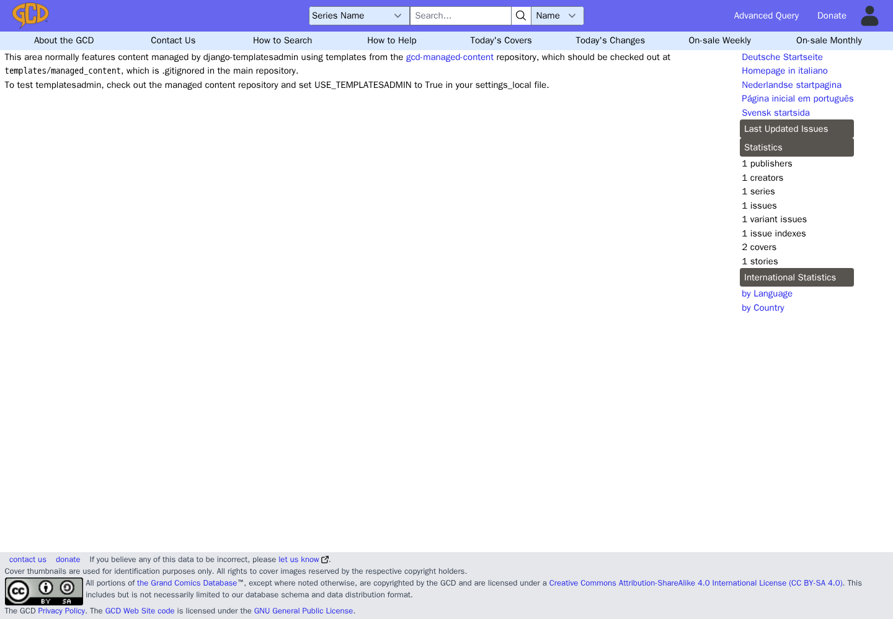
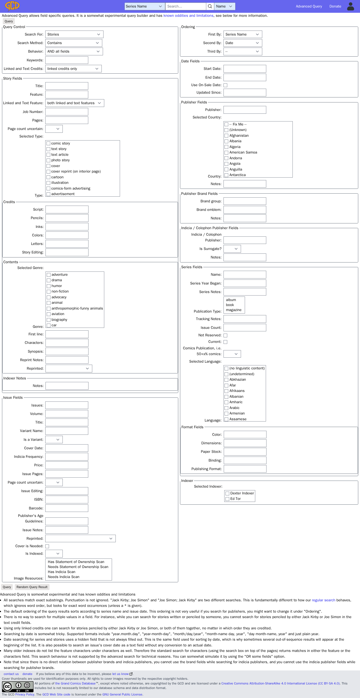
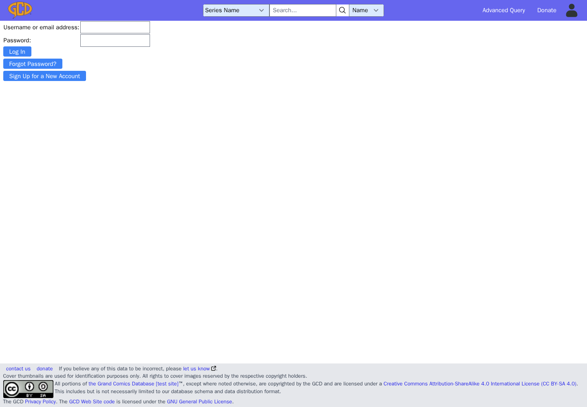

<!-- Generated by tests/wiki. Do not edit by hand. -->

# GCD user guide

These instructions and screenshots are generated together from tested browser actions and the current interface labels.

## Search the catalog

### Grand Comics Database

1. Open **Grand Comics Database** (`/`).

### GCD :: matching your query for '\[GCD DEV\] Adventures'

1. Open **Grand Comics Database** (`/`).
2. Select **Series Name** in the search selector.
3. Enter **\[GCD DEV\] Adventures** in **Search...**.
4. Select **search button**.

![GCD :: matching your query for '\[GCD DEV\] Adventures'](images/search-results.png)

## Explore publishers, series and issues

### GCD :: Series :: \[GCD DEV\] Adventures

1. Open **Grand Comics Database** (`/`).
2. Select **Series Name** in the search selector.
3. Enter **\[GCD DEV\] Adventures** in **Search...**.
4. Select **search button**.
5. Select **\[GCD DEV\] Adventures**.

![GCD :: Series :: \[GCD DEV\] Adventures](images/series.png)

### GCD :: Issue :: \[GCD DEV\] Adventures (\[GCD DEV\] Example Comics, 2024 series) #1

1. Select **1**.

![GCD :: Issue :: \[GCD DEV\] Adventures (\[GCD DEV\] Example Comics, 2024 series) #1](images/issue.png)

### GCD :: Publisher :: \[GCD DEV\] Example Comics

1. Open **Grand Comics Database** (`/`).
2. Select **Publisher Name** in the search selector.
3. Enter **\[GCD DEV\] Example Comics** in **Search...**.
4. Select **search button**.
5. Select **\[GCD DEV\] Example Comics**.

![GCD :: Publisher :: \[GCD DEV\] Example Comics](images/publisher.png)

## Find creators, characters, groups and features

### GCD :: Creator :: \[GCD DEV\] Alex Example (b. 1970)

1. Open **Grand Comics Database** (`/`).
2. Select **Creator Name** in the search selector.
3. Enter **\[GCD DEV\] Alex Example** in **Search...**.
4. Select **search button**.
5. Select **\[GCD DEV\] Alex Example (b. 1970)**.

![GCD :: Creator :: \[GCD DEV\] Alex Example (b. 1970)](images/creator.png)

### GCD :: Character :: \[GCD DEV\] Captain Example

1. Open **Grand Comics Database** (`/`).
2. Select **Character Name** in the search selector.
3. Enter **\[GCD DEV\] Captain Example** in **Search...**.
4. Select **search button**.
5. Select **\[GCD DEV\] Captain Example \[development sample\]**.

![GCD :: Character :: \[GCD DEV\] Captain Example](images/character.png)

### GCD :: Group :: \[GCD DEV\] Example League

1. Open **Grand Comics Database** (`/`).
2. Select **Group Name** in the search selector.
3. Enter **\[GCD DEV\] Example League** in **Search...**.
4. Select **search button**.
5. Select **\[GCD DEV\] Example League \[development sample\]**.

![GCD :: Group :: \[GCD DEV\] Example League](images/group.png)

### GCD :: Feature :: \[GCD DEV\] Feature

1. Open **Grand Comics Database** (`/`).
2. Select **Feature Name** in the search selector.
3. Enter **\[GCD DEV\] Feature** in **Search...**.
4. Select **search button**.
5. Select **\[GCD DEV\] Feature (English)**.

![GCD :: Feature :: \[GCD DEV\] Feature](images/feature.png)

## Use advanced queries

### GCD :: Advanced Query

1. Open **Grand Comics Database** (`/`).
2. Select **Advanced Query**.

Fields shown on this page:

- Search For:
- Search Method:
- Behavior:
- Keywords:
- Linked and Text Credits:
- Title:
- Feature:
- Linked and Text Feature:
- Job Number:
- Pages:
- Page count uncertain:
- Selected Type:
- Type:
- comic story
- text story
- text article
- photo story
- cover
- cover reprint (on interior page)
- cartoon
- illustration
- comics-form advertising
- advertisement
- promo (ad from the publisher)
- preview (from the publisher)
- activity
- in-house column
- public service announcement
- character profile
- statement of ownership
- foreword, introduction, preface, afterword
- credits, title page
- recap
- letters page
- insert or dust jacket
- filler
- about comics
- table of contents
- blank page(s)
- Script:
- Pencils:
- Inks:
- Colors:
- Letters:
- Story Editing:
- Selected Genre:
- Genre:
- adventure
- drama
- humor
- non-fiction
- advocacy
- animal
- anthropomorphic-funny animals
- aviation
- biography
- car
- children
- crime
- detective-mystery
- domestic
- erotica
- fantasy
- fashion
- historical
- history
- horror-suspense
- jungle
- martial arts
- math & science
- medical
- military
- nature
- religious
- romance
- satire-parody
- science fiction
- sports
- spy
- superhero
- sword and sorcery
- teen
- war
- western-frontier
- First line:
- Characters:
- Synopsis:
- Reprint Notes:
- Reprinted:
- Notes:
- Issues:
- Volume:
- Variant Name:
- Is a Variant:
- Cover Date:
- Indicia Frequency:
- Price:
- Issue Pages:
- Issue Editing:
- ISBN:
- Barcode:
- Publisher's Age Guidelines:
- Issue Notes:
- Cover is Needed:
- Is Indexed:
- Image Resources:
- First By:
- Second By:
- Third By:
- Start Date:
- End Date:
- Use On-Sale Date:
- Updated Since:
- Publisher:
- Selected Country:
- Country:
- -- Fix Me --
- (Unknown)
- Afghanistan
- Albania
- Algeria
- American Samoa
- Andorra
- Angola
- Anguilla
- Antarctica
- Antigua And Barbuda
- Argentina
- Armenia
- Aruba
- Australia
- Austria
- Azerbaijan
- Bahamas
- Bahrain
- Bangladesh
- Barbados
- Belarus
- Belgium
- Belize
- Benin
- Bermuda
- Bhutan
- Bolivia
- Bosnia And Herzegovina
- Botswana
- Bouvet Island
- Brazil
- British Indian Ocean Territory
- Brunei Darussalam
- Bulgaria
- Burkina Faso
- Burundi
- Cambodia
- Cameroon
- Canada
- Cape Verde
- Cayman Islands
- Central African Republic
- Chad
- Chile
- China
- Christmas Island
- Cocos (Keeling) Islands
- Colombia
- Comoros
- Congo
- Cook Islands
- Costa Rica
- Cote D'Ivoire (Ivory Coast)
- Croatia (Hrvatska)
- Cuba
- Cyprus
- Czech Republic
- Czechoslovakia (Former)
- Denmark
- Djibouti
- Dominica
- Dominican Republic
- East Timor
- Ecuador
- Egypt
- El Salvador
- Equatorial Guinea
- Eritrea
- Estonia
- Ethiopia
- Falkland Islands (Malvinas)
- Faroe Islands
- Fiji
- Finland
- France
- France, Metropolitan
- French Guiana
- French Polynesia
- French Southern Territories
- Gabon
- Gambia
- Georgia
- German Democratic Republic \[Former\]
- Germany
- Ghana
- Gibraltar
- Greece
- Greenland
- Grenada
- Guadeloupe
- Guam
- Guatemala
- Guinea
- Guinea-Bissau
- Guyana
- Haiti
- Heard And Mcdonald Islands
- Honduras
- Hong Kong
- Hungary
- Iceland
- India
- Indonesia
- Iran
- Iraq
- Ireland
- Israel
- Italy
- Jamaica
- Japan
- Jordan
- Kazakhstan
- Kenya
- Kiribati
- Korea (North)
- Korea (South)
- Kuwait
- Kyrgyzstan
- Laos
- Latvia
- Lebanon
- Lesotho
- Liberia
- Libya
- Liechtenstein
- Lithuania
- Luxembourg
- Macau
- Macedonia
- Madagascar
- Malawi
- Malaysia
- Maldives
- Mali
- Malta
- Marshall Islands
- Martinique
- Mauritania
- Mauritius
- Mayotte
- Mexico
- Micronesia
- Moldova
- Monaco
- Mongolia
- Montserrat
- Morocco
- Mozambique
- Myanmar
- Namibia
- Nauru
- Nepal
- Netherlands
- Netherlands Antilles
- Neutral Zone
- New Caledonia
- New Zealand (Aotearoa)
- Nicaragua
- Niger
- Nigeria
- Niue
- Norfolk Island
- Northern Mariana Islands
- Norway
- Oman
- Pakistan
- Palau
- Panama
- Papua New Guinea
- Paraguay
- Peru
- Philippines
- Pitcairn
- Poland
- Portugal
- Puerto Rico
- Qatar
- Reunion
- Romania
- Russian Federation
- Rwanda
- S. Georgia And S. Sandwich Isls.
- Saint Kitts And Nevis
- Saint Lucia
- Saint Vincent And The Grenadines
- Samoa
- San Marino
- Sao Tome And Principe
- Saudi Arabia
- Senegal
- Seychelles
- Sierra Leone
- Singapore
- Slovak Republic
- Slovenia
- Solomon Islands
- Somalia
- South Africa
- Spain
- Sri Lanka
- St. Helena
- St. Pierre And Miquelon
- Sudan
- Suriname
- Svalbard And Jan Mayen Islands
- Swaziland
- Sweden
- Switzerland
- Syria
- Taiwan
- Tajikistan
- Tanzania
- Thailand
- Togo
- Tokelau
- Tonga
- Trinidad And Tobago
- Tunisia
- Turkey
- Turkmenistan
- Turks And Caicos Islands
- Tuvalu
- Uganda
- Ukraine
- United Arab Emirates
- United Kingdom
- United States
- Uruguay
- Us Minor Outlying Islands
- Ussr (Former)
- Uzbekistan
- Vanuatu
- Vatican City State (Holy See)
- Venezuela
- Viet Nam
- Virgin Islands (British)
- Virgin Islands (U.S.)
- Wallis And Futuna Islands
- Western Sahara
- Yemen
- Yugoslavia
- Zaire
- Zambia
- Zimbabwe
- Brand group:
- Brand emblem:
- Indicia / Colophon Publisher:
- Is Surrogate?
- Name:
- Series Year Began:
- Series Notes:
- Publication Type:
- Tracking Notes:
- Issue Count:
- Not Reserved:
- Current:
- Comics Publication, i.e. 50+x% comics:
- Selected Language:
- Language:
- (no linguistic content)
- (undetermined)
- Abkhazian
- Afar
- Afrikaans
- Albanian
- Amharic
- Arabic
- Armenian
- Assamese
- Aymara
- Azerbaijani
- Bashkir
- Basque
- Bengali; Bangla
- Bhutani
- Bihari
- Bislama
- Bosnian
- Breton
- Bulgarian
- Burmese
- Byelorussian
- Cambodian
- Catalan
- Chinese
- Corsican
- Croatian
- Czech
- Danish
- Dutch
- English
- Esperanto
- Estonian
- Faeroese
- Filipino; Pilipino
- Finnish
- French
- Frisian
- Galician
- Georgian
- German
- Greek
- Greenlandic
- Guarani
- Gujarati
- Hausa
- Hebrew
- Hindi
- Hungarian
- Icelandic
- Indonesian
- Interlingua
- Interlingue
- Inupiak
- Irish
- Italian
- Japanese
- Javanese
- Kannada
- Kashmiri
- Kazakh
- Kinyarwanda
- Kirghiz
- Kirundi
- Korean
- Kurdish
- Laothian
- Latin
- Latvian, Lettish
- Lingala
- Lithuanian
- Macedonian
- Malagasy
- Malay
- Malayalam
- Maltese
- Maori
- Marathi
- Moldavian
- Mongolian
- Nepali
- Norwegian
- Occitan
- Oriya
- Oromo (Afan)
- Pashto, Pushto
- Persian
- Polish
- Portuguese
- Punjabi
- Quechua
- Rhaeto-Romance
- Romanian
- Russian
- Sami (Inari)
- Sami (Lule)
- Sami (Northern)
- Sami (Skolt)
- Sami (Southern)
- Sami languages
- Samoan
- Sangro
- Sanskrit
- Scots Gaelic
- Serbian
- Serbo-Croatian
- Sesotho
- Setswana
- Shona
- Sindhi
- Singhalese
- Siswati
- Slovak
- Slovenian
- Somali
- Spanish
- Sundanese
- Swahili
- Swedish
- Tagalog
- Tajik
- Tamil
- Tatar
- Telugu
- Thai
- Tibetan
- Tigrinya
- Tsonga
- Turkish
- Turkmen
- Twi
- Ukrainian
- Urdu
- Uzbek
- Vietnamese
- Volapuk
- Welsh
- Wolof
- Xhosa
- Yiddish
- Yoruba
- Zulu
- Color:
- Dimensions:
- Paper Stock:
- Binding:
- Publishing Format:
- Selected Indexer:
- Dexter Indexer
- Ed Tor

## Open the sign-in form

### Open the sign-in form

1. Open **Grand Comics Database** (`/`).
2. Select **account menu**.
3. Select **Log In**.

Fields shown on this page:

- Username or email address:
- Password:

## Coverage

The examples use fictional records marked **[GCD DEV]** and placeholder covers; search for real names on the public site.

Coverage is limited to the workflows listed above. Editing, approval, cover uploads, administration and My Comics are not yet included. Business rules cannot be inferred from page labels.
